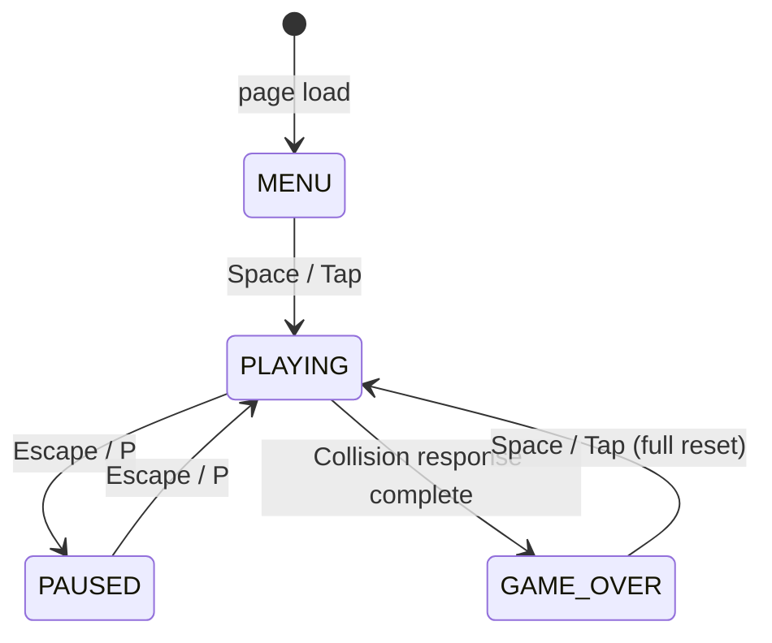

# Design Document: Flappy Kiro

## Overview

Flappy Kiro is a single-file, browser-based endless scroller game. The player taps or presses Space to flap a ghost character (Ghosty) through vertically-scrolling pipe obstacles. The game is self-contained in one HTML file, uses the Web Audio API for all sound (with two pre-loaded `.wav` assets), and renders everything on an HTML5 `<canvas>` element.

**Technology stack:**
- HTML5 Canvas 2D API — all rendering
- Web Audio API — sound effects and procedural background music
- Vanilla JavaScript (ES2020, no frameworks, no build step)
- `localStorage` — persistent high score

**Delivery:** A single `index.html` file that references assets via relative paths. Opening the file in any modern browser starts the game immediately.

---

## Architecture

The game is structured as a single JavaScript module embedded in `index.html`. Logical concerns are separated into clearly named sections/objects rather than separate files, keeping the delivery constraint while maintaining readability.

```
index.html
└── <script id="config">   — CONFIG object (all tuning constants, no logic)
└── <script> (single JS module)
    ├── ConfigLoader       — merges CONFIG block with URL query parameter overrides
    ├── AudioManager       — Web Audio context, sound effects, background music
    ├── StorageManager     — localStorage read/write with in-memory fallback
    ├── GameState          — state machine (MENU → PLAYING ↔ PAUSED → GAME_OVER)
    ├── Ghosty             — physics, sprite rendering, hitbox
    ├── PipeManager        — pipe pool, spawning, scrolling, scoring
    ├── CloudManager       — parallax cloud layers
    ├── ParticleSystem     — particle trail from Ghosty
    ├── EffectsManager     — screen shake, score popups
    └── GameLoop           — requestAnimationFrame loop, delta-time, state dispatch
```

### Configuration Strategy (Option B + C)

All numerical values are defined in a dedicated `<script id="config">` block at the top of `index.html`, **before** the game logic script. This block contains a single `const CONFIG = { ... }` object — no game logic, only data.

```html
<!-- TOP OF index.html — edit these values to tune the game -->
<script id="config">
const CONFIG = {
  CANVAS_W: 480,
  GRAVITY: 1200,
  ASCENT_VELOCITY: -500,
  // ... all constants
};
</script>
```

On startup, `ConfigLoader` merges `CONFIG` with any URL query parameter overrides, producing a final frozen `C` object used throughout the game:

```js
// URL override example:
// index.html?GRAVITY=900&PIPE_SPEED_INITIAL=200
const C = Object.freeze(ConfigLoader.load(CONFIG));
```

**Rules:**
- The game logic script **never** contains raw numeric literals — it always references `C.CONSTANT_NAME`.
- URL parameters are parsed as numbers and validated against the same keys present in `CONFIG`; unknown keys are ignored.
- If a URL parameter value is not a finite number, the `CONFIG` default is used instead.
- The `CONFIG` block is clearly commented so non-developers can tune the game without reading any logic code.

### State Machine



**State responsibilities:**

| State | Updates | Renders |
|---|---|---|
| `MENU` | Clouds scroll | Start screen, clouds |
| `PLAYING` | All systems | All systems |
| `PAUSED` | Nothing | Frozen frame + pause overlay |
| `GAME_OVER` | Clouds scroll | Game over screen, clouds |

---

## Components and Interfaces

### ConfigLoader

```js
const ConfigLoader = {
  load(defaults) {
    const params = new URLSearchParams(window.location.search);
    const overrides = {};
    for (const [key, value] of params) {
      if (key in defaults) {
        const n = Number(value);
        if (isFinite(n)) overrides[key] = n;
      }
    }
    return { ...defaults, ...overrides };
  }
};

// Resolved at startup — all game code uses C.CONSTANT_NAME
const C = Object.freeze(ConfigLoader.load(CONFIG));
```

### GameLoop

```js
function gameLoop(timestamp)
  // Computes dt (delta-time in seconds)
  // Dispatches update(dt) and render() based on current state
  // Calls requestAnimationFrame(gameLoop)
```

- Uses `performance.now()` timestamps.
- `dt` is clamped to a maximum of `MAX_DELTA` (e.g. 100 ms) to prevent spiral-of-death on tab blur.

### GameState

```js
const State = { MENU: 'MENU', PLAYING: 'PLAYING', PAUSED: 'PAUSED', GAME_OVER: 'GAME_OVER' }
let currentState = State.MENU

function transitionTo(newState)
  // Runs exit logic for currentState
  // Runs enter logic for newState
  // Sets currentState = newState
```

Input events are consumed by the state machine; a single keydown/click that triggers a transition is flagged as "consumed" so it cannot also fire a Flap in the same frame.

### Ghosty

```js
const ghosty = {
  x, y,              // position (x is fixed horizontally)
  vy,                // vertical velocity (px/s, scaled by dt)
  animState,         // 'idle' | 'flap' | 'death'
  animFrame,         // current frame index within the sheet
  animTimer,         // ms elapsed in current frame
  invincible,        // bool
  invincibleTimer,   // ms remaining
  flashVisible,      // bool (for collision flash)
}

function ghostyUpdate(dt)   // apply gravity, clamp terminal velocity, update position, advance animation state/frame
function ghostyFlap()       // set vy = C.ASCENT_VELOCITY, transition animState to 'flap'
function ghostyReset()      // restore initial position/velocity, reset animState to 'idle'
function ghostyDraw(ctx)    // draw correct spritesheet frame (or fallback rect); skip if !flashVisible
function ghostyHitbox()     // returns { x, y, w, h } inset by C.HITBOX_INSET
```

**Animation state machine:**
- `idle` → cycles frames `C.GHOSTY_IDLE_FRAMES` at `C.GHOSTY_IDLE_MS` per frame
- `flap` → holds frame `C.GHOSTY_FLAP_FRAME` for `C.GHOSTY_FLAP_MS` ms, then returns to `idle`
- `death` → plays frames `C.GHOSTY_DEATH_FRAMES` at `C.GHOSTY_DEATH_MS` per frame, holds on last frame

Sprite rotation is **not used** — the spritesheet frames communicate movement state visually. See `ghosty-sprites.md` for full frame layout and hitbox specification.

### PipeManager

```js
// Pipe object shape:
// { x, gapY, scored }

function pipesUpdate(dt)    // scroll all pipes left, remove off-screen, spawn new, check scoring
function pipesDraw(ctx)     // draw each pipe pair (top + bottom rects)
function pipesReset()       // clear pipe array, reset spawn state
function pipeHitboxes(pipe) // returns [topRect, bottomRect]
function spawnPipe()        // push new pipe with randomised gapY
```

### CloudManager

```js
// Cloud object shape:
// { x, y, r, layer }   (layer 0 = far/slow, layer 1 = near/fast)

function cloudsUpdate(dt)   // scroll each cloud by its layer speed, wrap at left edge
function cloudsDraw(ctx)    // draw semi-transparent ellipses
function cloudsInit()       // populate initial cloud positions for both layers
```

### ParticleSystem

```js
// Particle shape:
// { x, y, vx, vy, life, maxLife, alpha }

function particlesUpdate(dt)  // age particles, remove dead ones
function particlesEmit(x, y)  // spawn N particles at Ghosty's trailing edge
function particlesDraw(ctx)   // draw each particle with current alpha
function particlesReset()     // clear all particles
```

### EffectsManager

```js
let shakeTimer = 0      // ms remaining
let shakeMagnitude = 0  // current offset magnitude (decays)

// Score popup shape: { x, y, age, maxAge }
let scorePopups = []

function effectsUpdate(dt)          // decay shake, age popups
function effectsApplyShake(ctx)     // translate ctx by random offset scaled to shakeMagnitude
function effectsTriggerShake()      // set shakeTimer, shakeMagnitude = SHAKE_MAGNITUDE
function effectsSpawnPopup(x, y)    // push new score popup
function effectsDrawPopups(ctx)     // draw "+1" text with fade and upward drift
function effectsReset()             // clear shake and popups
```

### AudioManager

```js
function audioInit()              // create AudioContext (deferred until first input)
function audioPlayJump()          // play jump.wav buffer
function audioPlayGameOver()      // play game_over.wav buffer
function audioPlayScoreBeep()     // synthesise short beep via OscillatorNode
function audioBgStart()           // start procedural looping background music
function audioBgPause()           // suspend AudioContext
function audioBgResume()          // resume AudioContext
function audioBgStop()            // disconnect music nodes
```

Background music is generated by scheduling a repeating sequence of notes on an `OscillatorNode` connected through a `GainNode`. The melody loops indefinitely using `AudioBufferSourceNode` or a recursive `setTimeout` scheduler.

### StorageManager

```js
function storageGetHighScore()    // read from localStorage, fallback to inMemoryHighScore
function storageSetHighScore(n)   // write to localStorage, always update inMemoryHighScore
```

---

## Data Models

### CONFIG Block (Constants Table)

All values live in the `CONFIG` object in the `<script id="config">` block. The game accesses them via the resolved `C` object. URL query parameters can override any value by key name.

> All physics constants use **pixels per second** (not per frame), scaled by `dt` each update. This ensures frame-rate independence.

| Key | Default | Description |
|---|---|---|
| `CANVAS_W` | 480 | Canvas width (px) |
| `CANVAS_H` | 640 | Canvas height (px) |
| `GRAVITY` | 1200 | Downward acceleration (px/s²) |
| `ASCENT_VELOCITY` | -500 | Upward velocity on flap (px/s) |
| `TERMINAL_VELOCITY` | 700 | Max downward velocity (px/s) |
| `PIPE_SPEED_INITIAL` | 150 | Initial pipe scroll speed (px/s) |
| `PIPE_SPEED_INCREMENT` | 20 | Speed added per threshold (px/s) |
| `PIPE_SPEED_MAX` | 400 | Maximum pipe scroll speed (px/s) |
| `PIPE_SPEED_THRESHOLD` | 5 | Score interval for speed increase |
| `PIPE_WIDTH` | 52 | Pipe wall width (px) |
| `PIPE_GAP` | 120 | Vertical gap height (px) |
| `PIPE_PAIR_SPACING` | 220 | Horizontal distance between pipe pairs (px) |
| `PIPE_GAP_MIN_Y` | 80 | Minimum gap centre Y (px from top) |
| `PIPE_GAP_MAX_Y` | 560 | Maximum gap centre Y (px from top) |
| `GHOSTY_X` | 100 | Fixed horizontal position of Ghosty |
| `GHOSTY_W` | 40 | Ghosty render width (px) |
| `GHOSTY_H` | 40 | Ghosty render height (px) |
| `GHOSTY_FRAME_W` | 32 | Source frame width in spritesheet (px) |
| `GHOSTY_FRAME_H` | 32 | Source frame height in spritesheet (px) |
| `GHOSTY_FRAME_COUNT` | 7 | Total frames in spritesheet |
| `GHOSTY_IDLE_FRAMES` | [0,1,2] | Frame indices for idle animation |
| `GHOSTY_FLAP_FRAME` | 3 | Frame index for flap |
| `GHOSTY_DEATH_FRAMES` | [4,5,6] | Frame indices for death animation |
| `GHOSTY_IDLE_MS` | 150 | Idle frame duration (ms) |
| `GHOSTY_FLAP_MS` | 120 | Flap hold duration (ms) |
| `GHOSTY_DEATH_MS` | 80 | Death frame duration (ms) |
| `HITBOX_INSET` | 4 | Hitbox inset from sprite edges (px) |
| `INVINCIBILITY_MS` | 500 | Invincibility window after collision (ms) |
| `SHAKE_DURATION_MS` | 300 | Screen shake duration (ms) |
| `SHAKE_MAGNITUDE` | 8 | Max shake offset (px) |
| `PARTICLE_LIFESPAN` | 30 | Particle lifespan (frames at 60 fps) |
| `PARTICLE_COUNT` | 3 | Particles emitted per frame |
| `POPUP_DURATION_MS` | 600 | Score popup fade duration (ms) |
| `MAX_DELTA` | 0.1 | Max dt cap (seconds) |
| `CLOUD_SPEED_FAR` | 0.3 | Far cloud speed multiplier (relative to pipe speed) |
| `CLOUD_SPEED_NEAR` | 0.7 | Near cloud speed multiplier (relative to pipe speed) |
| `VOL_JUMP` | 0.4 | Jump sound volume |
| `VOL_GAME_OVER` | 0.6 | Game over sound volume |
| `VOL_SCORE_BEEP` | 0.3 | Score beep volume |
| `VOL_MUSIC` | 0.15 | Background music volume |

**URL override examples:**
```
index.html?GRAVITY=900&PIPE_SPEED_INITIAL=200
index.html?PIPE_GAP=150&PIPE_SPEED_MAX=300
index.html?VOL_MUSIC=0&VOL_JUMP=0.8
```

### Ghosty State Object

```ts
interface GhostyState {
  x: number;              // fixed at C.GHOSTY_X
  y: number;              // current vertical position (top of sprite)
  vy: number;             // vertical velocity (px/s; negative = up)
  animState: 'idle' | 'flap' | 'death';
  animFrame: number;      // current frame index in spritesheet
  animTimer: number;      // ms elapsed in current frame
  invincible: boolean;
  invincibleTimer: number; // ms
  flashVisible: boolean;
}
```

### Pipe Object

```ts
interface Pipe {
  x: number;     // left edge of pipe pair
  gapY: number;  // vertical centre of gap
  scored: boolean; // true once Ghosty has passed this pipe
}
```

### Cloud Object

```ts
interface Cloud {
  x: number;
  y: number;
  radiusX: number;
  radiusY: number;
  layer: 0 | 1;  // 0 = far (slow, small), 1 = near (fast, large)
}
```

### Particle Object

```ts
interface Particle {
  x: number;
  y: number;
  vx: number;
  vy: number;
  life: number;    // frames remaining
  maxLife: number;
}
```

### Score Popup Object

```ts
interface ScorePopup {
  x: number;
  y: number;
  age: number;    // ms elapsed
  maxAge: number; // = POPUP_DURATION_MS
}
```

---

## Key Algorithms

### Physics Update (delta-time scaled)

```js
function ghostyUpdate(dt) {
  if (ghosty.invincible) {
    ghosty.invincibleTimer -= dt * 1000;
    ghosty.flashVisible = Math.floor(ghosty.invincibleTimer / 80) % 2 === 0;
    if (ghosty.invincibleTimer <= 0) {
      ghosty.invincible = false;
      transitionTo(State.GAME_OVER);
    }
  }

  ghosty.vy += C.GRAVITY * dt;
  ghosty.vy = Math.min(ghosty.vy, C.TERMINAL_VELOCITY);
  ghosty.y += ghosty.vy * dt;

  // Advance animation frame
  ghosty.animTimer += dt * 1000;
  if (ghosty.animState === 'idle') {
    const frames = C.GHOSTY_IDLE_FRAMES;
    if (ghosty.animTimer >= C.GHOSTY_IDLE_MS) {
      ghosty.animTimer = 0;
      ghosty.animFrame = frames[(frames.indexOf(ghosty.animFrame) + 1) % frames.length];
    }
  } else if (ghosty.animState === 'flap') {
    if (ghosty.animTimer >= C.GHOSTY_FLAP_MS) {
      ghosty.animState = 'idle';
      ghosty.animTimer = 0;
      ghosty.animFrame = C.GHOSTY_IDLE_FRAMES[0];
    }
  } else if (ghosty.animState === 'death') {
    const frames = C.GHOSTY_DEATH_FRAMES;
    const idx = frames.indexOf(ghosty.animFrame);
    if (ghosty.animTimer >= C.GHOSTY_DEATH_MS && idx < frames.length - 1) {
      ghosty.animTimer = 0;
      ghosty.animFrame = frames[idx + 1]; // holds on last frame
    }
  }
}
```

### Pipe Spawning

```js
function pipesUpdate(dt) {
  const speed = currentPipeSpeed();

  for (const pipe of pipes) {
    pipe.x -= speed * dt;
  }

  // Remove off-screen pipes
  while (pipes.length && pipes[0].x + PIPE_WIDTH < 0) pipes.shift();

  // Spawn new pipe when gap opens up
  const lastPipe = pipes[pipes.length - 1];
  if (!lastPipe || lastPipe.x <= CANVAS_W - PIPE_PAIR_SPACING) {
    spawnPipe();
  }

  // Scoring
  for (const pipe of pipes) {
    if (!pipe.scored && pipe.x + PIPE_WIDTH < GHOSTY_X) {
      pipe.scored = true;
      score++;
      updatePipeSpeed();
      audioPlayScoreBeep();
      effectsSpawnPopup(pipe.x + PIPE_WIDTH / 2, pipe.gapY);
    }
  }
}
```

### Collision Detection

```js
function checkCollisions() {
  if (ghosty.invincible) return;

  const hb = ghostyHitbox(); // { x, y, w, h }

  // Ground / ceiling
  if (hb.y + hb.h >= CANVAS_H || hb.y <= 0) {
    triggerCollision();
    return;
  }

  // Pipes
  for (const pipe of pipes) {
    const [top, bottom] = pipeHitboxes(pipe);
    if (rectsOverlap(hb, top) || rectsOverlap(hb, bottom)) {
      triggerCollision();
      return;
    }
  }
}

function rectsOverlap(a, b) {
  return a.x < b.x + b.w && a.x + a.w > b.x &&
         a.y < b.y + b.h && a.y + a.h > b.y;
}
```

### Progressive Difficulty

```js
function currentPipeSpeed() {
  const increments = Math.floor(score / PIPE_SPEED_THRESHOLD);
  return Math.min(
    PIPE_SPEED_INITIAL + increments * PIPE_SPEED_INCREMENT,
    PIPE_SPEED_MAX
  );
}
```

Cloud layer speeds are derived as:
```js
cloudSpeed[layer] = currentPipeSpeed() * CLOUD_LAYER_SPEEDS[layer];
```

### Screen Shake

```js
function effectsApplyShake(ctx) {
  if (shakeTimer <= 0) return;
  const progress = shakeTimer / SHAKE_DURATION_MS; // 1 → 0
  const mag = SHAKE_MAGNITUDE * progress;          // decays linearly
  ctx.translate(
    (Math.random() * 2 - 1) * mag,
    (Math.random() * 2 - 1) * mag
  );
}
```

---

## Rendering Pipeline Order

Each frame the canvas is cleared and layers are drawn back-to-front:

1. **Clear** — `ctx.clearRect(0, 0, CANVAS_W, CANVAS_H)`
2. **Background fill** — solid sky colour
3. **Far clouds** (layer 0) — slow, small, low alpha
4. **Near clouds** (layer 1) — faster, larger, slightly higher alpha
5. **Pipes** — top and bottom rects with retro colour scheme
6. **Ground strip** — decorative ground bar at bottom
7. **Particles** — Ghosty's trailing particles
8. **Ghosty** — sprite (or fallback rect), rotated, with flash visibility
9. **Score popups** — "+1" text animations
10. **HUD** — score text (top-centre during PLAYING)
11. **State overlay** — MENU / PAUSED / GAME_OVER screen drawn on top

Screen shake is applied as a `ctx.save() / ctx.translate(shake) / ... / ctx.restore()` wrapping steps 2–10.

---

## Performance Optimisation Guidelines

The target is a stable **60 FPS** on mid-range hardware. The following guidelines apply to all implementation work.

### Frame Rate Target

- The game loop uses `requestAnimationFrame` exclusively — never `setInterval` or `setTimeout` for rendering.
- `dt` is clamped to `C.MAX_DELTA` (0.1 s) so a single slow frame cannot cause a physics explosion.
- All update logic is O(n) or better; no per-frame allocations in hot paths.

### Obstacle Pooling (PipeManager)

Pipes are managed with a fixed-size circular pool rather than allocating new objects each spawn:

```js
// Pre-allocate pool at startup
const PIPE_POOL_SIZE = 8; // max pipes ever visible + 1
const pipePool = Array.from({ length: PIPE_POOL_SIZE }, () => ({ x: 0, gapY: 0, scored: false, active: false }));

function spawnPipe() {
  const pipe = pipePool.find(p => !p.active); // O(8) — effectively O(1)
  if (!pipe) return; // pool exhausted (should never happen with correct sizing)
  pipe.x = C.CANVAS_W;
  pipe.gapY = randomGapY();
  pipe.scored = false;
  pipe.active = true;
}

function pipesUpdate(dt) {
  for (const pipe of pipePool) {
    if (!pipe.active) continue;
    pipe.x -= currentPipeSpeed() * dt;
    if (pipe.x + C.PIPE_WIDTH < 0) pipe.active = false; // return to pool
  }
}
```

- Pool size is calculated as `ceil(CANVAS_W / PIPE_PAIR_SPACING) + 2` — always enough slots, never over-allocated.
- No `Array.push` / `Array.shift` / `Array.splice` in the game loop — zero GC pressure from pipes.

### Particle Memory Management

Particles use a fixed-size ring buffer to avoid per-frame allocation:

```js
const PARTICLE_POOL_SIZE = C.PARTICLE_COUNT * C.PARTICLE_LIFESPAN * 2; // generous headroom
const particlePool = Array.from({ length: PARTICLE_POOL_SIZE }, () => ({ ... }));
let particleHead = 0; // ring buffer write head

function particlesEmit(x, y) {
  for (let i = 0; i < C.PARTICLE_COUNT; i++) {
    const p = particlePool[particleHead % PARTICLE_POOL_SIZE];
    // overwrite in place — no allocation
    p.x = x; p.y = y; p.life = C.PARTICLE_LIFESPAN; /* ... */
    particleHead++;
  }
}
```

- Particles are never pushed to or spliced from an array — the ring buffer overwrites stale slots.
- Dead particles (`life <= 0`) are skipped during draw with a cheap guard, not removed.

### Sprite Batching

The canvas 2D API does not support GPU sprite batching, but unnecessary state changes are minimised:

- **Group by `globalAlpha`**: all particles are drawn in a single pass with a shared `globalAlpha` set once per particle (unavoidable), but `ctx.save/restore` is called only at the start and end of the particle pass — not per particle.
- **Group by fill style**: pipes are all the same colour; `ctx.fillStyle` is set once before the pipe draw loop, not once per rect.
- **Ghosty sprite**: the `Image` object is decoded once at load time and reused every frame via `ctx.drawImage`. No re-decoding, no re-fetching.
- **Font**: `ctx.font` is set once per state overlay render, not per text call.
- **Avoid `ctx.save/restore` in tight loops**: only used where transform state genuinely needs isolation (screen shake wrapper, Ghosty rotation).

### Canvas Sizing and DPR

```js
function resizeCanvas() {
  const dpr = window.devicePixelRatio || 1;
  canvas.width  = C.CANVAS_W * dpr;
  canvas.height = C.CANVAS_H * dpr;
  canvas.style.width  = C.CANVAS_W + 'px';
  canvas.style.height = C.CANVAS_H + 'px';
  ctx.scale(dpr, dpr);
}
```

- The canvas is sized to the logical resolution × device pixel ratio so it renders crisp on HiDPI screens without blurring.
- `resizeCanvas` is called once on load; the canvas is never resized during gameplay.

### Avoiding Layout Thrash

- The canvas element is the only DOM element that changes; no DOM reads (e.g. `getBoundingClientRect`) occur inside the game loop.
- CSS scaling (`object-fit: contain` on a wrapper div) handles viewport fitting — no JS resize logic runs per frame.

### Profiling Checkpoints

During development, wrap the game loop body with `performance.mark` / `performance.measure` calls (guarded by a `DEBUG` flag defaulting to `false`) to identify frame budget overruns without shipping profiling overhead.

---

## Error Handling

| Scenario | Handling |
|---|---|
| `ghosty.png` fails to load | Draw a white rectangle of the same dimensions as fallback |
| `jump.wav` / `game_over.wav` fail to load | Log warning; audio functions become no-ops |
| `localStorage` unavailable | `StorageManager` catches `SecurityError`; uses `inMemoryHighScore` variable |
| Browser blocks autoplay | `AudioContext` is created on first user input event; all audio calls before that are queued or skipped |
| Tab blur causes large `dt` spike | `dt` is clamped to `MAX_DELTA` (0.1 s) to prevent physics explosion |
| `requestAnimationFrame` not available | Fallback to `setTimeout(gameLoop, 16)` |

---

## Testing Strategy

### Unit Tests

Focus on pure logic functions that have no DOM or audio dependencies:

- `ghostyHitbox()` — verify inset calculation for various sprite positions
- `rectsOverlap()` — verify AABB overlap for touching, overlapping, and separated rects
- `currentPipeSpeed()` — verify speed at score 0, at each threshold, and at max cap
- `spawnPipe()` — verify `gapY` is always within `[PIPE_GAP_MIN_Y, PIPE_GAP_MAX_Y]`
- `storageGetHighScore()` / `storageSetHighScore()` — verify read/write and fallback behaviour
- Score increment logic — verify `pipe.scored` flag prevents double-counting

### Property-Based Tests

See Correctness Properties section below. Each property is implemented as a property-based test using a library appropriate for the target language (e.g., **fast-check** for JavaScript/TypeScript). Each test runs a minimum of **100 iterations**.

Tag format for each test:
```
// Feature: flappy-kiro, Property N: <property text>
```

### Integration / Smoke Tests

- Canvas renders without throwing (smoke)
- AudioContext initialises after a simulated user gesture (smoke)
- Full game loop runs for 5 seconds without error (integration)
- High score persists across simulated page reload using a mock `localStorage` (integration)


---

## Correctness Properties

*A property is a characteristic or behavior that should hold true across all valid executions of a system — essentially, a formal statement about what the system should do. Properties serve as the bridge between human-readable specifications and machine-verifiable correctness guarantees.*

Each property below is implemented as a property-based test using **fast-check** (JavaScript). Each test runs a minimum of **100 iterations**. Tests are tagged with:
```
// Feature: flappy-kiro, Property N: <property text>
```

---

### Property 1: Gravity and Momentum Conservation

*For any* initial vertical velocity `vy` and any valid delta-time `dt`, after one physics update, Ghosty's new velocity should equal `clamp(vy + GRAVITY * dt, -Infinity, TERMINAL_VELOCITY)`, and Ghosty's new position should equal `oldY + newVy * dt`.

**Validates: Requirements 2.1, 11.1, 11.4, 11.5**

---

### Property 2: Flap Always Sets Ascent Velocity

*For any* current vertical velocity `vy` (however large or small), calling `ghostyFlap()` should always set `vy` to exactly `ASCENT_VELOCITY`, replacing the previous value entirely.

**Validates: Requirements 2.2, 11.2**

---

### Property 3: Terminal Velocity Clamp

*For any* vertical velocity value that exceeds `TERMINAL_VELOCITY` after gravity is applied, the resulting velocity after `ghostyUpdate(dt)` should always be clamped to at most `TERMINAL_VELOCITY`.

**Validates: Requirements 11.3**

---

### Property 4: Rotation Monotonically Tracks Velocity

*For any* two vertical velocity values `vy1 < vy2`, the rotation assigned to `vy1` should be less than or equal to the rotation assigned to `vy2`, and all rotations should fall within the range `[-PI/6, PI/2]`.

**Validates: Requirements 2.5**

---

### Property 5: Pipe Scrolling Correctness

*For any* pipe at position `x` and any valid `dt`, after one `pipesUpdate(dt)` call, the pipe's new `x` should equal `x - currentPipeSpeed() * dt`.

**Validates: Requirements 3.1**

---

### Property 6: Pipe Gap Position Always Within Bounds

*For any* newly spawned pipe, its `gapY` value should always satisfy `PIPE_GAP_MIN_Y <= gapY <= PIPE_GAP_MAX_Y`, regardless of how many pipes have been spawned or what the current score is.

**Validates: Requirements 3.5, 3.6**

---

### Property 7: Off-Screen Pipes Are Removed

*For any* game state after `pipesUpdate(dt)` is called, no pipe in the active pipe array should have `pipe.x + PIPE_WIDTH < 0`.

**Validates: Requirements 3.7**

---

### Property 8: Progressive Speed Formula and Cap

*For any* score value `s >= 0`, `currentPipeSpeed()` should equal `min(PIPE_SPEED_INITIAL + floor(s / PIPE_SPEED_THRESHOLD) * PIPE_SPEED_INCREMENT, PIPE_SPEED_MAX)`, and should never exceed `PIPE_SPEED_MAX` regardless of how large `s` is.

**Validates: Requirements 12.3, 12.4**

---

### Property 9: Cloud Speed Proportional to Pipe Speed

*For any* pipe speed value, each cloud layer's scroll speed should equal `pipeSpeed * CLOUD_LAYER_SPEEDS[layer]`, maintaining the parallax depth ratio regardless of the current difficulty level.

**Validates: Requirements 12.5**

---

### Property 10: Hitbox Inset Correctness

*For any* Ghosty position `(x, y)`, `ghostyHitbox()` should return `{ x: x + HITBOX_INSET, y: y + HITBOX_INSET, w: GHOSTY_W - 2 * HITBOX_INSET, h: GHOSTY_H - 2 * HITBOX_INSET }`.

**Validates: Requirements 4.1**

---

### Property 11: Collision Detection Completeness

*For any* pair of axis-aligned rectangles that geometrically overlap, `rectsOverlap(a, b)` should return `true`; for any pair that do not overlap (including touching edges), it should return `false`.

**Validates: Requirements 4.2, 4.3, 4.4, 4.5**

---

### Property 12: Invincibility Suppresses Collisions

*For any* game state where `ghosty.invincible === true`, calling the collision detection routine should never trigger a state transition or start a new invincibility timer, regardless of Ghosty's position relative to pipes or boundaries.

**Validates: Requirements 4.7**

---

### Property 13: Score Increments Exactly Once Per Pipe

*For any* pipe that Ghosty passes (i.e., `pipe.x + PIPE_WIDTH < GHOSTY_X`), the score should increment by exactly 1 and `pipe.scored` should be set to `true`, ensuring the same pipe cannot be scored again on subsequent frames.

**Validates: Requirements 5.1**

---

### Property 14: High Score Persistence Round-Trip

*For any* non-negative integer score value written via `storageSetHighScore(n)`, a subsequent call to `storageGetHighScore()` should return exactly `n`, both when `localStorage` is available and when it is unavailable (in-memory fallback).

**Validates: Requirements 1.4, 5.3, 5.4**

---

### Property 15: Pause Freezes All Game Object Positions

*For any* game state while `currentState === PAUSED`, calling the update function any number of times should leave all game object positions (Ghosty `y`, all pipe `x` values, all cloud `x` values, all particle positions, all popup positions) completely unchanged.

**Validates: Requirements 13.4, 14.8**

---

### Property 16: Restart Resets All Game State to Initial Values

*For any* game state (arbitrary score, arbitrary pipe positions, arbitrary Ghosty position and velocity), triggering a restart should reset score to 0, pipe speed to `PIPE_SPEED_INITIAL`, Ghosty's position to the initial spawn point, Ghosty's velocity to 0, and the active pipe array to empty.

**Validates: Requirements 7.7**

---

### Property 17: Screen Shake Decays Linearly

*For any* shake timer value `t` in `[0, SHAKE_DURATION_MS]`, the effective shake magnitude should equal `SHAKE_MAGNITUDE * (t / SHAKE_DURATION_MS)`, smoothly approaching zero as the timer expires.

**Validates: Requirements 14.1, 14.2**

---

### Property 18: Particle Opacity Decreases Monotonically with Age

*For any* particle, as its `life` value decreases from `maxLife` toward 0, its rendered alpha should decrease monotonically (never increase), reaching 0 when `life === 0`.

**Validates: Requirements 14.4**

---

### Property 19: Score Popup Drifts Up and Fades with Age

*For any* score popup, as its `age` increases from 0 toward `maxAge`, its rendered `y` position should decrease (drift upward) and its alpha should decrease monotonically, reaching 0 at `age === maxAge`.

**Validates: Requirements 14.6**

---

### Property 20: Cloud Wrapping Maintains Continuous Coverage

*For any* cloud that scrolls off the left edge of the canvas (`cloud.x + cloud.radiusX < 0`), after the next `cloudsUpdate(dt)` call, that cloud should be repositioned at the right edge of the canvas, ensuring the cloud field never has gaps.

**Validates: Requirements 10.5**
