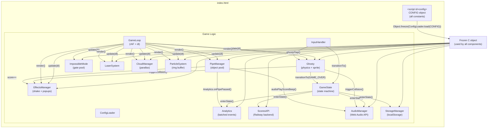
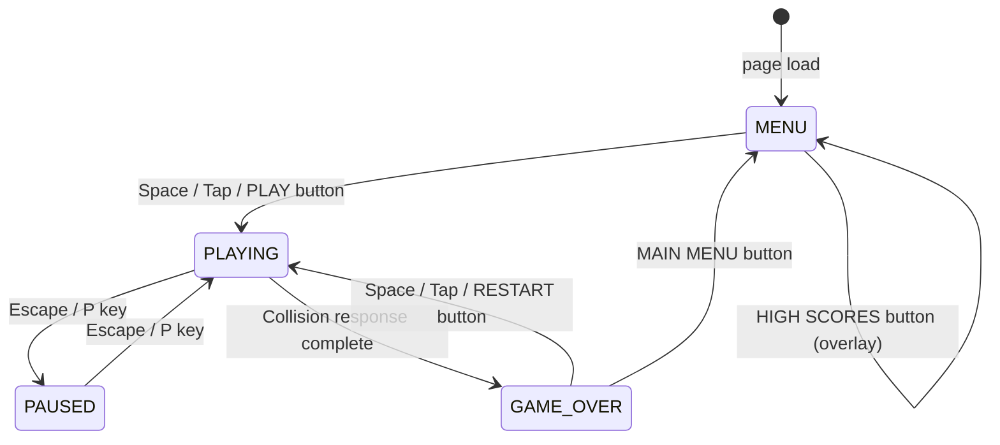
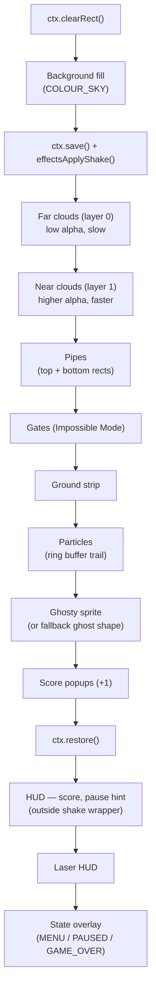
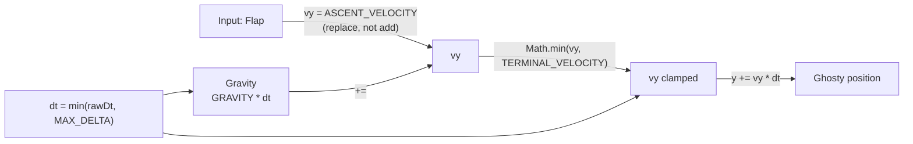
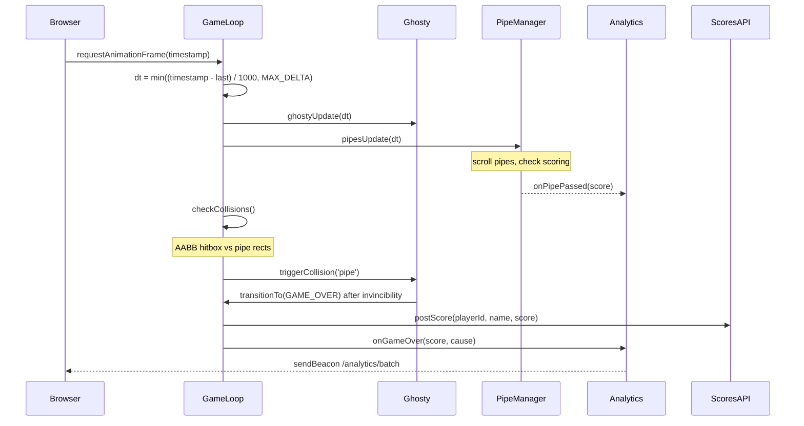
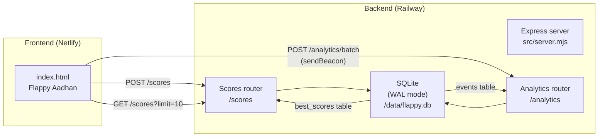
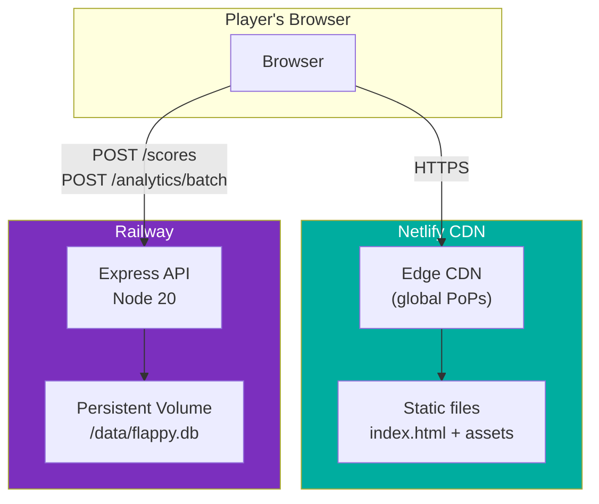

# Flappy Aadhan

A retro-styled, browser-based endless scroller game inspired by Flappy Bird. Control Ghosty — a ghost character — through vertically-scrolling pipe obstacles. Built entirely in vanilla JavaScript with no frameworks, no build step, and no backend required.

**Live:** https://jazzy-duckanoo-b37c36.netlify.app


---

## Table of Contents

1. [Project Overview](#project-overview)
2. [Architecture](#architecture)
3. [Component Diagram](#component-diagram)
4. [Game State Machine](#game-state-machine)
5. [Rendering Pipeline](#rendering-pipeline)
6. [Physics System](#physics-system)
7. [Data Flow](#data-flow)
8. [Backend Architecture](#backend-architecture)
9. [Deployment Architecture](#deployment-architecture)
10. [File Structure](#file-structure)
11. [Configuration Reference](#configuration-reference)
12. [How to Run Locally](#how-to-run-locally)
13. [Deployment](#deployment)
14. [Analytics & Crash Reporting](#analytics--crash-reporting)
15. [Agent Hooks](#agent-hooks)
16. [Full Prompt History](#full-prompt-history)

---

## Project Overview

| Property | Value |
|---|---|
| Language | Vanilla JavaScript (ES2020) |
| Rendering | HTML5 Canvas 2D API |
| Audio | Web Audio API (procedural + WAV assets) |
| Persistence | `localStorage` (high score) |
| Delivery | Single `index.html` + 3 asset files |
| Canvas size | 480 × 640 px (HiDPI-aware) |
| Target FPS | 60 |
| Live URL | https://jazzy-duckanoo-b37c36.netlify.app |

---

## Architecture

The game is a single `index.html` file. All logic lives in one embedded `<script>` tag, separated into clearly named component groups. A separate `<script id="config">` block holds all tuning constants — no logic, only data.

```
index.html
├── <script id="config">        ← All tuning constants (CONFIG object)
└── <script id="game-logic">    ← All game code
    ├── ConfigLoader            ← Merges CONFIG with URL query overrides → frozen C object
    ├── Analytics               ← Batched event tracking + crash reporting
    ├── ScoresAPI               ← Railway backend integration (optional)
    ├── AudioManager            ← Web Audio context, WAV buffers, procedural music
    ├── StorageManager          ← localStorage read/write with in-memory fallback
    ├── Ghosty                  ← Physics, sprite rendering, animation state machine
    ├── PipeManager             ← Object pool (8 slots), spawning, scrolling, scoring
    ├── ImpossibleMode          ← Gate pool, gravity flip mechanic
    ├── LaserSystem             ← Recharge timer, beam visual, pipe carving
    ├── CloudManager            ← Parallax cloud layers (2 layers, 7 clouds each)
    ├── ParticleSystem          ← Ring buffer (180 slots), trail emission
    ├── EffectsManager          ← Screen shake, score popups
    ├── GameState               ← 4-state machine (MENU/PLAYING/PAUSED/GAME_OVER)
    ├── InputHandler            ← Keyboard + pointer, input consumption flag
    └── GameLoop                ← requestAnimationFrame, delta-time, update→render
```

---

## Component Diagram



---

## Game State Machine



**State responsibilities:**

| State | Updates | Renders |
|---|---|---|
| `MENU` | Clouds scroll | Title, high score, prompt, clouds, ground |
| `PLAYING` | All systems | All systems |
| `PAUSED` | Nothing | Frozen frame + dim overlay + "PAUSED" text |
| `GAME_OVER` | Clouds, effects | Score, high score, NEW BEST, clouds, ground |

**Input consumption:** A single Space/tap that triggers a state transition sets `inputConsumed = true`, preventing the same event from also firing a Flap in the same frame.

---

## Rendering Pipeline

Every frame, the canvas is cleared and layers are drawn back-to-front:



Screen shake is applied as a `ctx.translate()` inside a `ctx.save/restore` wrapping steps 4–11. The HUD is drawn outside the shake wrapper so it stays stable during collisions.

---

## Physics System



**Constants (pixels/second):**

| Constant | Value | Effect |
|---|---|---|
| `GRAVITY` | 800 px/s² | Downward acceleration per frame |
| `ASCENT_VELOCITY` | −300 px/s | Velocity set on flap (replaces current) |
| `TERMINAL_VELOCITY` | 700 px/s | Maximum downward speed |
| `MAX_DELTA` | 0.1 s | dt cap — prevents physics explosion on tab blur |

**Jump arc:** Peak rise ≈ 56 px, hang time ≈ 0.75 s at default constants.

---

## Data Flow



---

## Backend Architecture

The optional Railway backend provides leaderboard persistence and analytics. The frontend works fully without it — `C.API_ENDPOINT` defaults to `''`.



**API endpoints:**

| Method | Path | Description |
|---|---|---|
| `GET` | `/health` | Healthcheck |
| `POST` | `/scores` | Submit score — upserts personal best only |
| `GET` | `/scores?limit=N` | Top-N leaderboard |
| `GET` | `/scores/:playerId` | Player profile + history |
| `POST` | `/analytics/batch` | Ingest batched game events |
| `GET` | `/analytics/overview` | 30-day summary (API key required) |
| `GET` | `/analytics/crashes` | JS error report (API key required) |
| `GET` | `/analytics/performance` | Frame metrics + asset load times (API key required) |
| `GET` | `/analytics/behaviour` | Collision cause breakdown (API key required) |

---

## Deployment Architecture



**Cache strategy:**
- `index.html` — `no-cache, no-store, must-revalidate` (always fresh)
- `assets/*` — `public, max-age=31536000, immutable` (1 year, filenames are stable)

---

## File Structure

```
Flappy_Kiro/
├── index.html              ← Entire game (HTML + CSS + JS, ~50 KB)
├── game-config.json        ← Reference copy of all CONFIG values
├── netlify.toml            ← Netlify build config, headers, CSP, Lighthouse plugin
├── _headers                ← Netlify cache headers fallback
├── _redirects              ← Netlify redirects (minimal — no SPA catch-all)
├── package.json            ← Dev scripts + Netlify plugin dependency
│
├── assets/
│   ├── ghosty.png          ← Ghost sprite (1290×1567 px single image)
│   ├── jump.wav            ← Flap sound effect
│   └── game_over.wav       ← Collision sound effect
│
├── scripts/
│   └── perf-check.mjs      ← Pre-deploy performance validator
│
├── backend/                ← Optional Railway backend
│   ├── railway.toml        ← Railway build + healthcheck config
│   ├── package.json        ← Express + better-sqlite3 + zod
│   ├── .env.example        ← Environment variable reference
│   └── src/
│       ├── server.mjs      ← Express app, CORS, rate limiting
│       ├── db.mjs          ← SQLite schema + prepared statements
│       └── routes/
│           ├── scores.mjs  ← POST/GET /scores
│           └── analytics.mjs ← Event ingestion + reporting
│
├── infra/                  ← AWS SAM deployment (alternative to Netlify)
│   ├── template.yaml       ← CloudFormation: S3 + CloudFront + Lambda + DynamoDB
│   └── deploy.sh           ← One-command AWS deploy script
│
├── lambda/                 ← AWS Lambda handlers (alternative backend)
│   ├── scores.mjs          ← postScore + getLeaderboard
│   └── package.json
│
├── .kiro/
│   ├── specs/flappy-kiro/
│   │   ├── requirements.md ← Full requirements document
│   │   ├── design.md       ← Architecture + algorithms + data models
│   │   └── tasks.md        ← Implementation task checklist
│   ├── hooks/              ← Automated validation hooks (8 hooks)
│   └── steering/           ← AI coding standards + visual design reference
│
└── img/
    └── example-ui.png      ← UI reference screenshot
```

---

## Configuration Reference

All values live in the `<script id="config">` block in `index.html`. Override any value via URL query parameter:

```
https://jazzy-duckanoo-b37c36.netlify.app?GRAVITY=1200&PIPE_GAP=100
```

| Key | Default | Description |
|---|---|---|
| `CANVAS_W` / `CANVAS_H` | 480 / 640 | Canvas dimensions (px) |
| `GRAVITY` | 800 | Downward acceleration (px/s²) |
| `ASCENT_VELOCITY` | −300 | Upward velocity on flap (px/s) |
| `TERMINAL_VELOCITY` | 700 | Max downward speed (px/s) |
| `MAX_DELTA` | 0.1 | dt cap in seconds |
| `PIPE_SPEED_INITIAL` | 120 | Starting scroll speed (px/s) |
| `PIPE_SPEED_INCREMENT` | 20 | Speed added per threshold (px/s) |
| `PIPE_SPEED_MAX` | 400 | Hard cap on pipe speed (px/s) |
| `PIPE_SPEED_THRESHOLD` | 5 | Score interval for speed increase |
| `PIPE_WIDTH` | 52 | Pipe wall width (px) |
| `PIPE_GAP` | 140 | Vertical gap height (px) |
| `PIPE_PAIR_SPACING` | 350 | Horizontal distance between pipes (px) |
| `PIPE_GAP_MIN_Y` | 80 | Min gap centre Y from top (px) |
| `PIPE_GAP_MAX_Y` | 560 | Max gap centre Y from top (px) |
| `GHOSTY_X` | 100 | Fixed horizontal position (px) |
| `GHOSTY_W` / `GHOSTY_H` | 40 / 40 | Sprite render size (px) |
| `HITBOX_INSET` | 4 | Hitbox inset on all sides (px) |
| `INVINCIBILITY_MS` | 500 | Post-collision invincibility window (ms) |
| `SHAKE_DURATION_MS` | 300 | Screen shake duration (ms) |
| `SHAKE_MAGNITUDE` | 8 | Max shake offset (px) |
| `PARTICLE_LIFESPAN` | 30 | Particle lifespan in frames |
| `PARTICLE_COUNT` | 3 | Particles emitted per frame |
| `POPUP_DURATION_MS` | 600 | Score popup fade duration (ms) |
| `CLOUD_SPEED_FAR` | 0.15 | Far cloud speed multiplier |
| `CLOUD_SPEED_NEAR` | 0.55 | Near cloud speed multiplier |
| `GROUND_HEIGHT` | 32 | Ground strip height (px) |
| `COLOUR_SKY` | `#87CEEB` | Sky background colour |
| `COLOUR_PIPE` | `#388E3C` | Pipe fill colour |
| `FONT_FAMILY` | `Press Start 2P` | Retro pixel font |
| `DEBUG` | `false` | Enable FPS overlay + hitbox debug draw |
| `API_ENDPOINT` | `''` | Railway backend URL (optional) |

---

## How to Run Locally

```bash
# Python (no install required)
python3 -m http.server 8765
# Open http://localhost:8765/index.html

# Or Node
npx serve . -p 8765
```

**Controls:**

| Input | Action |
|---|---|
| Space / ↑ / ↓ / Tap | Flap (or start / restart) |
| P / Escape | Pause / Resume |
| L | Fire laser (when recharged) |

---

## Deployment

### Netlify (live)

```bash
# Install CLI
npm install -g netlify-cli

# Login
netlify login

# Deploy to production
netlify deploy --prod --dir . --site 3e09ba7b-5896-4934-a28d-b27db7766df2
```

The `netlify.toml` build command runs `node scripts/perf-check.mjs` before every deploy. It fails the build if:
- `index.html` exceeds 300 KB
- Any asset exceeds its threshold
- `console.log`, `debugger`, or `setInterval` are found in source
- `DEBUG: true` is set in CONFIG

### Railway backend (optional)

```bash
cd backend
npm install
railway login
railway init
# Add volume at /data in Railway dashboard
railway up
```

Then set `API_ENDPOINT` in `index.html` to your Railway URL.

### AWS (alternative)

```bash
brew install aws-sam-cli
./infra/deploy.sh --region us-east-1
```

---

## Analytics & Crash Reporting

The `Analytics` module in `index.html` tracks all player behaviour, performance metrics, and errors. Events are batched (flush every 5 s or 50 events) and sent via `sendBeacon` on game-over/unload.

**Tracked events:**

| Event | Trigger |
|---|---|
| `game_start` | New game begins |
| `flap_milestone` | Every 10 flaps |
| `score_milestone` | Scores 5, 10, 25, 50, 100 |
| `impossible_triggered` | Gate entered |
| `laser_fired` | Laser used |
| `pause` / `resume` | P / Esc key |
| `game_over` | Death — includes duration, flap count, collision cause, new-best flag |
| `perf_sample` | Every 300 frames — avg frame ms, budget miss rate |
| `asset_loaded` | Each asset decoded — load time in ms |
| `asset_failed` | Asset 404 or decode error |
| `js_error` | `window.onerror` — message, source, line, stack, game state |
| `unhandled_rejection` | Unhandled promise rejections |
| `session_end` | Page unload via `pagehide` |

---

## Agent Hooks

Eight automated validation hooks run on file save:

| Hook | Trigger | Validates |
|---|---|---|
| `perf-static-check` | `index.html` saved | FPS patterns, allocation in hot paths, rendering anti-patterns |
| `js-perf-memory-check` | `*.js` saved | 60 FPS budget, memory leaks, pool integrity |
| `perf-monitoring` | `index.html` / `*.js` saved | Animation smoothness, physics correctness, asset loading |
| `game-state-consistency` | `index.html` / `*.js` saved | Ghosty state, pipe pool, state machine invariants |
| `collision-physics-scoring-validation` | `index.html` / `*.js` saved | Hitbox math, physics constants, scoring accuracy |
| `balance-difficulty-gap-validation` | `index.html` / `game-config.json` saved | Jump arc, pipe spacing, gap sizing safety |
| `movement-bounds-wall-rules-score-accuracy` | `index.html` / `*.js` saved | Boundary enforcement, spawn rules, score double-count prevention |
| `auto-commit-on-save` | File saved | Stages and commits changes automatically |

---

## Full Prompt History

Every prompt used to build this game from scratch, in order:

---

### Phase 1 — Specification

> *"[Spec created via Kiro spec workflow — requirements, design, and tasks generated from the Flappy Kiro game concept]"*

The spec was created using Kiro's built-in spec workflow, which produced three documents:
- `requirements.md` — 14 requirements with acceptance criteria
- `design.md` — architecture, component interfaces, data models, algorithms, correctness properties
- `tasks.md` — 19 implementation tasks with sub-tasks

---

### Phase 2 — Implementation (via spec tasks)

Tasks 1–19 were executed by the agent working through `tasks.md`:

1. Scaffold `index.html` with CONFIG block and canvas layout
2. Implement ConfigLoader and frozen `C` object
3. Implement HiDPI canvas sizing and game loop skeleton
4. Implement GameState machine
5. Implement StorageManager
6. Implement Ghosty physics and rendering
7. Checkpoint — ensure all tests pass
8. Implement PipeManager with object pool
9. Implement progressive difficulty
10. Implement collision detection
11. Checkpoint — ensure all tests pass
12. Implement CloudManager with parallax layers
13. Implement ParticleSystem with ring buffer
14. Implement EffectsManager (screen shake and score popups)
15. Implement AudioManager
16. Checkpoint — ensure all tests pass
17. Wire all components into the game loop and state machine
18. Implement all screen overlays (HUD and state screens)
19. Final checkpoint — ensure all tests pass

---

### Phase 3 — Hooks & Validation

> *"Create hook to validate game performance with 60 FPS targets and memory leak detection on *.js files."*

> *"Generate performance monitoring hook for animation smoothness, physics calculations, and asset loading times."*

> *"Create hook that validates game state consistency when Ghosty, Wall, or GameEngine classes are modified."*

> *"Generate validation hook for collision boundaries, physics constants, and scoring logic integrity."*

> *"Create hook to check game mechanics balance, difficulty progression, and wall gap sizing validation."*

> *"Generate game state hook for Ghosty movement bounds, wall generation rules, and score calculation accuracy."*

---

### Phase 4 — Visual & Gameplay Fixes

> *"I now don't see the ghosty in the game. Also why the background is not the sky blue?"*

Fixed: `ghosty.png` is 1290×1567 px (not a spritesheet). Updated `ghostyDraw` to detect spritesheet by exact dimensions rather than width threshold. Improved fallback ghost shape visibility.

> *"Why the background sky color is dark blue? Shouldn't it be sky blue?"*

Changed `COLOUR_SKY` from `#1A1A2E` (retro dark navy) to `#87CEEB` (daytime sky blue).

> *"Can you make the game name from Flappy Kiro to Flappy Aadhan?"*

Updated `<title>` and all `fillText('FLAPPY KIRO')` calls to `FLAPPY AADHAN`.

---

### Phase 5 — Production Optimisation

> *"Prepare Flappy Kiro for production with optimized Canvas rendering, asset bundling, and performance tuning."*

Applied:
- Google Fonts loaded non-render-blocking (`media="print" onload`)
- `font-display: swap` CSS override
- Pre-allocated `_topRect` / `_bottomRect` for collision detection (zero GC per frame)
- `Date.now()` removed from render hot path → replaced with rAF `lastTimestamp`
- `cloudsUpdate` computes pipe speed once per frame (was 14× per frame)
- `cloudsDraw` merged into single pool pass with one `ctx.save/restore`

---

### Phase 6 — Deployment

> *"Suggest AWS deployment architectures for this game, along with the pros and cons for each option."*

Four options presented: S3+CloudFront, Amplify, EC2, Lambda@Edge.

> *"Deploy Flappy Kiro frontend to S3 and CloudFront, and backend API to Lambda with DynamoDB for scores."*

Created `infra/template.yaml` (SAM/CloudFormation) and `lambda/scores.mjs`.

> *"Configure Netlify deployment with build optimization, asset caching, and performance monitoring."*

Created `netlify.toml`, `_headers`, `_redirects`, `scripts/perf-check.mjs`.

> *"Deploy game backend to Railway with high score persistence, leaderboard API, and player analytics."*

Created `backend/` with Express + SQLite + Zod. Endpoints: `POST /scores`, `GET /scores`, `GET /scores/:playerId`, `POST /analytics/batch`, `GET /analytics/overview|daily|crashes|performance|behaviour`.

> *"Set up game analytics with player behavior tracking, performance metrics, and crash reporting."*

Added `Analytics` IIFE module to `index.html` with batched event queue, `sendBeacon` on unload, `window.onerror` crash capture, per-frame performance sampling, and asset load timing.

> *"Option 2"* (Netlify CLI deploy)

```bash
npm install -g netlify-cli
netlify login
netlify deploy --prod --dir . --site 3e09ba7b-5896-4934-a28d-b27db7766df2
```

---

### Phase 7 — Production Debugging

> *"The live site is not working. Can you check what went wrong?"*

Root cause 1: `/*` catch-all redirect in `_redirects` was intercepting asset requests and serving `index.html` instead of `ghosty.png`, `jump.wav`, `game_over.wav`. Fixed by removing the redirect.

Root cause 2: CSP `connect-src` missing Google Fonts domains. Fixed.

> *"Still no luck."*

Root cause 3: `<script type="module">` creates an isolated scope — `CONFIG` defined in the classic `<script id="config">` tag was invisible inside the module. The game loop crashed silently on `C` being undefined. Fixed by removing `type="module"`.

> *"Still no luck."*

Root cause 4: Duplicate `ghostyFlap` function body left by a partial string replacement when adding `Analytics.onFlap()`. The stray `}` caused a `SyntaxError` that crashed the entire script. Fixed by removing the duplicate body.

> *"Yep it worked now."*

---

### Phase 8 — Documentation

> *"Add extensive README for the application including mermaid diagrams showing how the code fits together, all the prompts used for making this application a working model - starting from the requirements to production deployment, and all the comments used."*

This README.

---

## Key Design Decisions

**Why a single HTML file?**
Zero deployment friction. Open in any browser, no build step, no server required. The CONFIG block at the top lets non-developers tune the game without reading logic code.

**Why no `type="module"`?**
ES modules have isolated scope. The `CONFIG` object defined in a classic `<script>` tag is not accessible inside a module. Since the game has no actual imports/exports, `type="module"` adds no value and caused the production black screen bug.

**Why object pooling for pipes and particles?**
`Array.push/shift/splice` in the game loop creates GC pressure that causes frame drops. Pre-allocated pools with `active` flags produce zero allocations in the hot path.

**Why SQLite on Railway instead of a managed DB?**
For a game leaderboard with low write volume, SQLite in WAL mode on a persistent volume is simpler, cheaper, and faster than Postgres or DynamoDB. No connection pooling, no network round-trips to a separate DB host.

**Why batch analytics events?**
One network request per game event would be noisy and slow. Batching every 5 seconds (or 50 events) reduces requests by ~50× while still capturing all data. `sendBeacon` ensures the final batch is delivered even on page unload.
